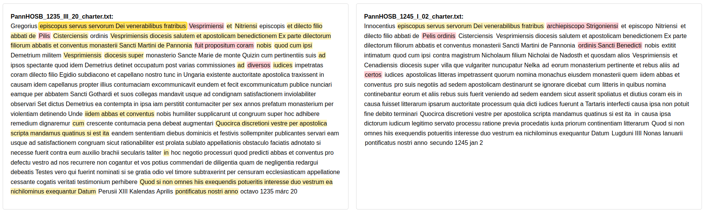

# FLAME - Formulaic Language Analysis in Medieval Expressions

FLAME is a Python-based tool for identifying and analyzing formulaic expressions in medieval texts using a Leave-N-Out (LNO) n-gram approach. This method is particularly effective for detecting variant forms of formulaic expressions that differ due to scribal variations, regional differences, or dialectal changes. You find a downloadable demo in the repository (text_comparisons.html)

<p align="center">
  
</p>

The LNO-ngram approach works as follows:

1. Generate n-grams of specified length (k) from input texts
2. For each n-gram, create variants by removing n tokens (where 1 ≤ n < k)
Consider the medieval charter opening: "In nomine sancte et individue trinitatis amen"

## Method comparsion
### N-gram (n=5) Analysis
| Input Text | Generated N-grams | Matches Original? |
|------------|------------------|-------------------|
| "In nomine sancte et individue" | [In nomine sancte et individue] | Yes |
| "In dei nomine sancte et" | [In dei nomine sancte et] | No |
| "In nomine sancte trinitatis amen" | [In nomine sancte trinitatis amen] | No |

### Skip-gram (k=2) Analysis
| Input Text | Generated Skip-grams | Matches Original? |
|------------|---------------------|-------------------|
| "In nomine sancte et individue" | [In sancte], [In et], [nomine individue], etc. | Partial |
| "In dei nomine sancte et" | [In nomine], [In sancte], [dei et], etc. | Partial |
| "In nomine sancte trinitatis amen" | [In sancte], [nomine trinitatis], etc. | Partial |

### Leave-n-out N-gram Analysis
| Input Text | Generated Patterns (n=1, k=5) | Match Score | 
|------------|------------------------------|--------------|
| "In nomine sancte et individue" | [_ nomine sancte et individue] | 0.92 |
| | [In _ sancte et individue] | | |
| | [In nomine _ et individue] | | |
| | [In nomine sancte _ individue] | | |
| | [In nomine sancte et _] | | |
| "In dei nomine sancte et" | [_ dei nomine sancte et] | 0.85 |
| | [In _ nomine sancte et] | | |
| | [In dei _ sancte et] | | |
| | [In dei nomine _ et] | | |
| | [In dei nomine sancte _] | | |
| "In nomine sancte trinitatis amen" | [_ nomine sancte trinitatis amen] | 0.88 |
| | [In _ sancte trinitatis amen] | | |
| | [In nomine _ trinitatis amen] | | |
| | [In nomine sancte _ amen] | | |
| | [In nomine sancte trinitatis _] | | |
4. Convert tokens to integers for efficient comparison
5. Calculate Intersection over Union (IoU) similarity between texts
6. Identify and visualize matching patterns

## Features

- **LNO-ngram Analysis**: Systematically generates partial matches by removing combinations of tokens from traditional n-grams
- **Interactive Visualization**: Provides both heatmap and detailed HTML-based visualizations of text similarities
- **Flexible Pattern Matching**: Identifies variant forms of formulaic expressions across different manuscript traditions
- **Configurable Parameters**: Easily adjust analysis settings through command-line arguments
- **Recursive File Processing**: Automatically processes all text files in a directory and its subdirectories

## Installation

```bash
pip install -r requirements.txt
```

Required dependencies:
- numpy
- tqdm
- plotly
- fargv
- IPython

## Usage

### Basic Usage

```bash
python flame.py --input_path /path/to/texts --file_suffix .txt
```

### Configuration Parameters

| Parameter | Default | Description |
|-----------|---------|-------------|
| input_path | ./testdir | Directory containing text files |
| file_suffix | .txt | File suffix to process |
| keep_texts | 200 | Maximum number of texts to analyze |
| ngram | 4 | Size of n-grams |
| n_out | 1 | Number of tokens to remove |
| min_text_length | 100 | Minimum text length to consider |
| similarity_threshold | 0.1 | Minimum similarity threshold |

### Example

```bash
python flame.py --input_path ./medieval_texts --ngram 5 --n_out 2 --similarity_threshold 0.15
```

## Output

FLAME generates three types of output:

1. **Similarity Matrix** (dist_mat.npy): NumPy array containing pairwise similarity scores
2. **Interactive Heatmap** (similarity_heatmap.html): Visual representation of text similarities
3. **Detailed Comparison** (text_comparisons.html): Interactive visualization showing:
   - Matched text segments with highlighting
   - Bridge words between similar sections
   - Similarity scores for each text pair
   - File source information

## Visualization Features

### Heatmap View
- Color-coded representation of similarity scores
- Interactive tooltips showing exact similarity values
- Adjustable threshold for focusing on high-similarity pairs

### Text Comparison View, see [demo].text_comparisons.html)
- Side-by-side text comparison
- Click-to-highlight matching sections
- Automatic scrolling alignment
- Bridge word highlighting for connecting similar sections
- Toggle controls for visualization features



## License
Apache 2.0
