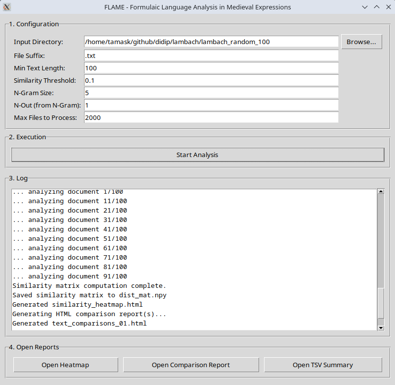

# FLAME: Formulaic Language Analysis in Medieval Expressions
 

[](https://opensource.org/licenses/Apache-2.0)

**FLAME** is a Python-based tool with both **Command-Line (CLI)** and **Graphical (GUI)** interfaces, designed for identifying and analyzing formulaic language and text reuse, particularly in historical corpora like medieval charters (20k charters comparsion is 40s with a Dell Precision 3660 workstation). It uses a **Leave-N-Out (LNO) n-gram** approach, which is highly effective for detecting variant forms of expressions that differ due to scribal variations, regional dialects, or other textual modifications.

A downloadable demo of the HTML output can be found in the repository (`text_comparisons_demo.html`).

<p align="center">
  
</p>

## How It Works

The LNO-gram approach systematically creates robust features from text. For a given sequence of words (an n-gram), it generates multiple variants by omitting a specified number of tokens. This allows the system to identify underlying similarities even if the surface forms are not identical.

Consider the medieval charter opening: *"In nomine sancte et individue trinitatis amen"*

1.  **Generate n-grams**: The tool slides a window of a specified length (e.g., 5 words) across the text.
2.  **Create LNO variants**: For each 5-gram, it creates subsequences by removing a specified number of tokens (e.g., 1). For the 5-gram `[In, nomine, sancte, et, individue]`, it would generate features like `[_, nomine, sancte, et, individue]`, `[In, _, sancte, et, individue]`, etc.
3.  **Hashing**: Each variant is converted into a unique, memory-efficient integer hash.
4.  **Similarity Calculation**: The tool calculates the cosine similarity between documents based on the frequency of these shared feature hashes.
5.  **Visualization**: Results are presented in interactive reports that highlight matching patterns in their original context.

### Method Comparison

The LNO-gram method offers a balance of context-preservation and flexibility that is often superior to traditional n-grams or skip-grams for historical text analysis.

| Method | Input Text | Generated Patterns (Examples) | Match Score | Notes |
|--------|------------|-------------------|-------------|--------|
| **N-gram** | `In nomine sancte et individue` | `[In nomine sancte et individue]` | 1.0 | Rigid, requires perfect match. |
| (n=5) | `In dei nomine sancte et` | `[In dei nomine sancte et]` | 0.0 | Fails with minor variation. |
| **Skip-gram**| `In nomine sancte et individue` | `[In sancte]`, `[nomine et]` | ~0.4 | Loses word order and context. |
| (n=2, k=1) | `In dei nomine sancte et` | `[In nomine]`, `[dei sancte]` | ~0.3 | Creates many noisy pairs. |
| **LNO-gram**| `In nomine sancte et individue` | `[_ nomine sancte et individue]`, ... | ~0.92 | High flexibility, preserves context. |
| (n=5, r=1) | `In dei nomine sancte et` | `[dei nomine sancte et _]`, ... | ~0.85 | Effectively captures variants. |

*Where `n` is the window size, `k` is the number of skips, and `r` is the number of removed tokens. Match scores are illustrative.*

---

## Key Features

-   **Advanced LNO-gram Analysis**: Systematically generates partial matches by removing combinations of tokens from traditional n-grams.
-   **Adaptive Character Normalization**: Autonomously learns and applies normalization rules (e.g., `é` -> `e`) to reduce noise from character variations.
-   **Automatic Threshold Detection**: Intelligently determines the optimal similarity threshold using Otsu's method, removing the need for manual guesswork.
-   **Dual Interface**: Can be run as a powerful command-line tool or through a user-friendly Graphical User Interface (GUI).
-   **Comprehensive Reporting**: Generates multiple outputs for in-depth analysis, including interactive HTML reports and detailed TSV files.
-   **High Performance & Scalability**: Handles large corpora by using sparse matrices, iterative vocabulary building, and efficient hashing.

---

## Installation

It is highly recommended to use a Python virtual environment.

1.  **Clone the repository:**
    ```bash
    git clone https://github.com/kreeedit/FLAME
    cd FLAME
    ```

2.  **Create and activate a virtual environment:**
    ```bash
    python -m venv venv
    source venv/bin/activate  # On Windows, use `venv\Scripts\activate`
    ```

3.  **Install dependencies from `requirements.txt`:**
    ```bash
    pip install -r requirements.txt
    ```

4.  **Download NLTK data:** Run the following command in a Python interpreter to download the necessary 'punkt' tokenizer models.
    ```python
    import nltk
    nltk.download('punkt')
    ```
---

## Usage

You can run the analysis using either the GUI or the CLI.

### Graphical User Interface (GUI)

The GUI provides an intuitive way to set all parameters and monitor the analysis progress.

<p align="center">
  
</p>

To launch the graphical interface, run:
```bash
python flame_gui.py
```

### Command-Line Interface (CLI)

To see all available options and their defaults, run:
```bash
python flame.py --help
```

**Example:**
```bash
python flame.py --input_path ./medieval_texts --ngram 10 --n_out 2 --similarity_threshold auto
```

### All CLI Arguments

| Parameter | Default | Description |
|-----------|---------|-------------|
| `input_path` | `./corpus1` | **Required.** Path to the primary corpus directory. |
| `input_path2`| `''` | Optional path to a second corpus for inter-corpus comparison. |
| `file_suffix`| `.txt` | File extension of texts to process. |
| `keep_texts` | `20000` | Maximum number of texts to load from each directory. |
| `ngram` | `10` | The size of the n-gram window for feature generation. |
| `n_out` | `2` | Number of tokens to "leave out" from each n-gram. |
| `min_text_length` | `50` | Minimum character length for a file to be included. |
| `similarity_threshold` | `'auto'` | Similarity cutoff. Can be a float (e.g., `0.5`) or `'auto'`. |
| `auto_threshold_method` | `'otsu'` | Method for auto-thresholding: `'otsu'` or `'percentile'`. |
| `char_norm_alphabet` | (see code) | String of allowed characters for normalization. |
| `char_norm_strategy` | `'normalize'` | Strategy for unknown characters (e.g., Unicode decomposition). |
| `char_norm_min_freq` | `2` | Min. frequency for the adaptive normalizer to learn a rule. |

---

## Outputs

FLAME generates up to four types of output files in the directory where it is run:

1.  **`dist_mat.npz`**: A SciPy sparse matrix file containing all pairwise similarity scores. Essential for re-analysis without re-computing.
2.  **`text_comparisons_XX.html`**: Interactive HTML files for visually comparing similar document pairs. This is the primary output for analysis. Features include:
    -   Side-by-side text comparison with synchronized highlighting.
    -   Static highlighting of "almost-matching" words on the left.
    -   Dynamic, on-click highlighting of corresponding words on the right.
    -   Controls to show/hide all similarities at once.
3.  **`similarity_summary.tsv`**: A high-level summary listing each document, how many other documents it is similar to, the names of those documents, and any long matching phrases (>4 words).
4.  **`linguistic_variations.tsv`**: A detailed TSV file for linguistic analysis, logging every "similar" and "different" word pair found in the short gaps (1-3 words) between main text matches. This is invaluable for studying micro-variations.

<p align="center">
    
</p>

---

## Acknowledgements

The character normalization components are inspired by and build upon the principles found in **Anguelos Nicolaou's** 
 library. Anguelos's efficient character mapping was a valuable reference for this project.

---

## License

This project is licensed under the **Apache 2.0 License**.
