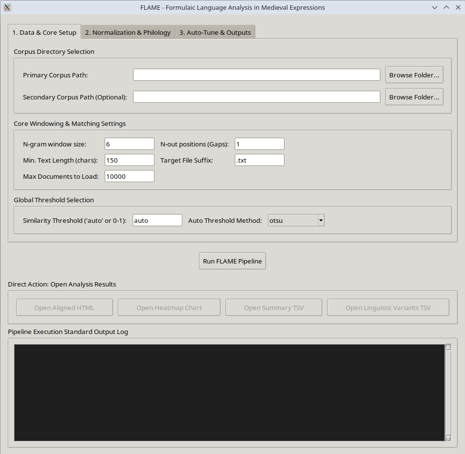

# FLAME: Formulaic Language Analysis in Medieval Expressions
 

[](https://opensource.org/licenses/Apache-2.0)

**FLAME** is a Python-based tool with both **Command-Line (CLI)** and **Graphical (GUI)** interfaces, designed for identifying and analyzing formulaic language and text reuse, particularly in historical corpora like medieval charters. It uses a **Leave-N-Out (LNO) n-gram** approach, which is highly effective for detecting variant forms of expressions that differ due to scribal variations, regional dialects, or other textual modifications. It automatically learns normalization rules from the corpus itself (handling medieval ligatures and special characters) and uses subword tokenization to absorb rare words and morphological variants. It automatically suggests an optimal vocabulary size for the tokenizer based on the corpus's statistical properties, offers an autonomous **Self-Supervised Auto-Tune** engine to discover ideal window properties, and automatically determines an optimal similarity cutoff score using Otsu's method.

A downloadable demo of the HTML output can be found in the repository (`text_comparisons_demo.html`).

<p align="center">
  
</p>

## How It Works

The LNO-gram approach systematically creates robust features from text. For a given sequence of words (an n-gram), it generates multiple variants by omitting a specified number of tokens. This allows the system to identify underlying similarities even if the surface forms are not identical.

Consider the medieval charter opening: *"In nomine sancte et individue trinitatis amen"*

1.  **Generate n-grams**: The tool slides a window of a specified length (e.g., 5 words) across the text.
2.  **Create LNO variants**: For each 5-gram, it creates subsequences by removing a specified number of tokens (e.g., 1). For the 5-gram `[In, nomine, sancte, et, individue]`, it would generate features like `[_, nomine, sancte, et, individue]`, `[In, _, sancte, et, individue]`, etc.
3.  **Hashing**: Each variant is converted into a unique, memory-efficient integer hash using a vectorised polynomial rolling hash.
4.  **Similarity Calculation**: The tool calculates the cosine similarity between documents based on the frequency of these shared sparse feature hashes, scaled via TF-IDF.
5.  **Visualization**: Results are presented in interactive reports that highlight matching patterns in their original context with browser-side adjustments.

### Method Comparison

The LNO-gram method offers a balance of context-preservation and flexibility that is often superior to traditional n-grams or skip-grams for historical text analysis.

| Method | Input Text | Subword Tokens (Example) | Generated Patterns (Examples) | Match Score | Notes |
| :--- | :--- | :--- | :--- | :--- | :--- |
| **N-gram** | `In nomine sancte et individue` | `[' In', ' nomine', ' sancte', ' et', ' individue']` | `[In nomine sancte et individue]` | 1.0 | Rigid. Fails if a single word changes (e.g., `dei` for `nomine`). |
| (n=5) | `In dei nomine sancte et` | `[' In', ' dei', ' nomine', ' sancte', ' et']` | `[In dei nomine sancte et]` | 0.0 | No tolerance for variation. |
| **Skip-gram**| `In nomine sancte et individue` | `[' In', ' nomine', ' sancte', ' et', ' individue']` | `[In sancte]`, `[nomine et]` | ~0.4 | Loses word order and creates noisy, out-of-context pairs. |
| (n=2, k=1) | `In dei nomine sancte et` | `[' In', ' dei', ' nomine', ' sancte', ' et']` | `[In nomine]`, `[dei sancte]` | ~0.3 | High noise, low contextual accuracy. |
| **FLAME** | `In nomine sancte et individue` | `[' In', ' nom', 'ine', ' sanct', 'e', ' et', ' in', 'di', 'vid', 'ue']` | `[nomine sancte et _]`, `[In _ sancte et individue]`... | ~0.95 | **High flexibility.** Captures whole-word and sub-word variations. |
| **(LNO-gram + Subword)** | `In dei nomine sancte et` | `[' In', ' dei', ' nom', 'ine', ' sanct', 'e', ' et']` | `[dei nomine sancte et _]`... | ~0.90 | **Robust.** Effectively matches even with novel words or spellings by comparing their constituent parts. |

*Where `n` is the window size, `k` is the number of skips, and `r` is the number of removed tokens. Match scores are illustrative.*

---

## Key Features

-   **Advanced LNO-gram Analysis**: Systematically generates partial matches by removing combinations of tokens from traditional n-grams.
-   **Autonomous Parameter Auto-Tuning**: Features a self-supervised "trial digging" engine that injects synthetic transcription/dialect noise into a sample of your text to automatically find the optimal `ngram` and `n_out` setup for your specific data.
-   **Adaptive Character Normalization**: Autonomously learns and applies normalization rules (e.g., `é` -> `e`, MUFI ligatures) using rapid, vectorized NumPy lookup views over the Unicode Basic Multilingual Plane.
-   **Automatic Threshold Detection**: Intelligently determines the optimal similarity threshold using Otsu's method on non-zero sparse data, removing manual guesswork.
-   **Modern Tabbed Interface (GUI)**: Built with a clean, beginner-friendly tabbed layout (`ttk.Notebook`) to separate data configurations, philological fine-tuning, and execution reporting.
-   **Dynamic Client-Side Highlights**: Side-by-side alignment outputs include interactive HTML/JS sliders, letting you change the fuzzy match sensitivity for structural bridge words on the fly inside your web browser.
-   **High Performance & Scalability**: Handles heavy historical corpora by utilizing memory-efficient sparse matrices and fast matrix-vector products.

---

## Installation

It is highly recommended to use a Python virtual environment.

1.  **Clone the repository:**
    ```bash
    git clone [https://github.com/kreeedit/FLAME](https://github.com/kreeedit/FLAME)
    cd FLAME
    ```

2.  **Create and activate a virtual environment:**
    ```bash
    python -m venv venv
    source venv/bin/activate  # On Windows, use `venv\Scripts\activate`
    ```

3.  **Install dependencies from `requirements.txt`:**
    ```bash
    pip install -r requirements.txt
    ```

4.  **Download NLTK data:** Run the following command in a Python interpreter to download the necessary tokenizer models.
    ```python
    import nltk
    nltk.download('punkt')
    nltk.download('punkt_tab')
    ```
---

## Usage

You can run the analysis using either the GUI or the CLI.

### Graphical User Interface (GUI)

The GUI provides an intuitive way to set all parameters, execute autonomous tuning sweeps, and monitor progress across tab containers.

<p align="center">
  
</p>

To launch the graphical interface, run:
```bash
python flame_gui.py

```

### Command-Line Interface (CLI)

To see all available options and their defaults, run:

```bash
python flame.py --help

```

**Example (Using Auto-Tune):**

```bash
python flame.py --input_path ./path/to/texts --auto_tune True --similarity_threshold auto

```

### All CLI Arguments

| Parameter | Default | Description |
| --- | --- | --- |
| `input_path` | `''` | **Required.** Path to the primary corpus directory. |
| `input_path2` | `''` | Optional path to a second corpus directory for cross-inter-corpus comparison. |
| `file_suffix` | `.txt` | File extension of text documents to process. |
| `keep_texts` | `10000` | Maximum number of texts to load from each directory. |
| `ngram` | `6` | The size of the n-gram window for feature generation. |
| `n_out` | `1` | Number of tokens to "leave out" (drop) from each n-gram window. |
| `min_text_length` | `150` | Minimum character length for a file to be included in the corpus. |
| `similarity_threshold` | `'auto'` | Similarity cutoff score. Can be a float (e.g., `0.75`) or `'auto'`. |
| `auto_threshold_method` | `'otsu'` | Method for auto-thresholding: `'otsu'` or `'percentile'`. |
| `char_norm_alphabet` | `abcdef...` | String of allowed lowercase base characters for normalization. |
| `char_norm_strategy` | `'normalize'` | Strategy for handling unknown out-of-alphabet characters. |
| `char_norm_min_freq` | `1` | Minimum frequency for the adaptive normalizer to register an automated Unicode rule. |
| `vocab_size` | `'auto'` | Target subword vocabulary size. Can be an integer or `'auto'` to calculate via morphology. |
| `vocab_min_word_freq` | `5` | Minimum frequency for a word to be evaluated for affix candidates. |
| `vocab_coverage` | `0.85` | Desired morphological coverage percentage of the corpus when `vocab_size` is `'auto'`. |
| `fuzz_threshold` | `0.75` | Base fuzzy string ratio metric (0-1) to classify non-matching gaps as "similar" bridge variants. |
| `max_gap_words` | `5` | Maximum structural token length allowed inside an individual non-matching gap segment. |
| `auto_tune` | `False` | Enables self-supervised parameter discovery via temporary synthetic noise sweeps. |
| `auto_tune_sample_size` | `30` | Number of document vectors to isolate and sample when executing an `auto_tune` sweep. |
| `no_reports` | `False` | If True, skips generating user-facing visual summaries and reports completely. |

---

## Outputs

FLAME generates up to four types of output files in the directory where it is run:

1. **`dist_mat.npz`**: A SciPy sparse matrix file containing all pairwise similarity scores. Essential for downstream validation without re-computing features.
2. **`text_comparisons_XX.html`**: Interactive side-by-side alignment report files. This is the primary visualization engine for philological exploration. Features include:
* Synchronized scroll-locking and text matching cross-highlights.
* A **Live Fuzzy Slider** to dynamically adjust the color classification threshold of structural bridge variants on-the-fly.
* Directional layout control which places earlier documents on the left based on filename year markers.


3. **`similarity_summary.tsv`**: A spreadsheet summary detailing related matches, document frequencies, and prominent, long-standing matching blocks (>4 words).
4. **`linguistic_variations.tsv`**: A structured corpus-wide register logging alternative spellings, contractions, and lexical substitutions identified inside identical formulaic expressions.

---

## Recipes

### Find long, near-verbatim text reuse

Ideal for identifying direct text copying, textual transmission lineages, or structural plagiarism with minimal alterations.

```python
DEFAULT_PARAMS = {
    'input_path': './corpus',
    'file_suffix': '.txt',
    'keep_texts': 100000,
    'ngram': 15,                      # Target long sequential strings
    'n_out': 1,                       # Enforce rigid matching (only 1 drop allowed)
    'min_text_length': 150,
    'similarity_threshold': 0.85,     # High threshold bar for rigid matches
    'auto_threshold_method': 'otsu',
    'char_norm_alphabet': "abcdefghijklmnopqrstuvwxyz",
    'char_norm_strategy': 'normalize',
    'char_norm_min_freq': 2,
    'vocab_size': 8000,               # Large vocabulary to force whole-word evaluation units
    'vocab_min_word_freq': 3,
    'vocab_coverage': 0.85,
}

```

### Find rephrased or restructured text

Utilizes balanced windows while extending token dropping limits to see through heavy lexical changes and active alterations.

```python
DEFAULT_PARAMS = {
    'input_path': './corpus',
    'file_suffix': '.txt',
    'keep_texts': 100000,
    'ngram': 10,                      # Phrase-level matching properties
    'n_out': 3,                       # Higher tolerance for token shifts and insertions
    'min_text_length': 150,
    'similarity_threshold': 0.60,     # Moderate cutoff to surface paraphrased reuse
    'auto_threshold_method': 'otsu',
    'char_norm_alphabet': "abcdefghijklmnopqrstuvwxyz",
    'char_norm_strategy': 'normalize',
    'char_norm_min_freq': 2,
    'vocab_size': 'auto',             # Handled flexibly via subwords
    'vocab_min_word_freq': 3,
    'vocab_coverage': 0.85,
}

```

### Find formulaic language / arengas

The standard optimized configurations. Leverages autonomous adaptive thresholds alongside gapped footprints to harvest historical formulae.

```python
DEFAULT_PARAMS = {
    'input_path': './corpus',
    'file_suffix': '.txt',
    'keep_texts': 100000,
    'ngram': 6,                       # Standard formulaic anchor bounds
    'n_out': 1,                       # Adaptive single gap indexing
    'similarity_threshold': 'auto',   # Calibrate cut-offs automatically via Otsu
    'auto_threshold_method': 'otsu',
    'char_norm_alphabet': "abcdefghijklmnopqrstuvwxyz",
    'char_norm_strategy': 'normalize',
    'char_norm_min_freq': 1,
    'vocab_size': 'auto',             # Morphologically optimized on-the-fly
    'vocab_min_word_freq': 5,
    'vocab_coverage': 0.85,
}

```

---

## Acknowledgements

The character normalization components are inspired by and build upon the principles found in **Anguelos Nicolaou's**  library. Anguelos's efficient character mapping was a valuable reference for this project.

---

## Cite

### APA Style

Kovács, T. (2025). *FLAME: Formulaic Language Analysis in Medieval Expressions* (Version 1.0.0) [Computer software]. GitHub. https://github.com/kreeedit/FLAME

### BibTeX

```bibtex
@software{Kovacs_FLAME_2025,
  author = {Kovács, Tamás},
  title = {{FLAME: Formulaic Language Analysis in Medieval Expressions}},
  version = {1.0.0},
  publisher = {Zenodo},
  year = {2025},
  doi = {10.5281/zenodo.15805449},
  url = {[https://github.com/kreeedit/FLAME](https://github.com/kreeedit/FLAME)}
}

```

---

## License

This project is licensed under the **Apache 2.0 License**.
