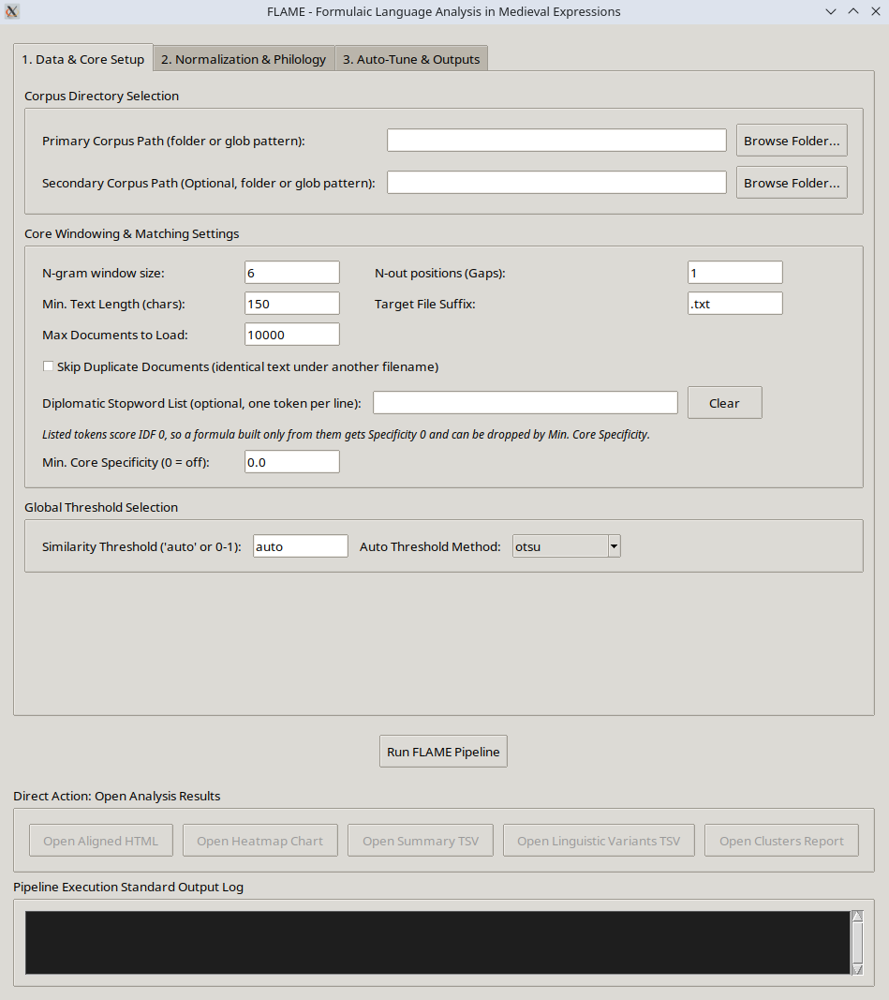

# FLAME: Formulaic Language Analysis in Medieval Expressions
 

[](https://opensource.org/licenses/Apache-2.0)

**FLAME** is a Python tool with **command-line** and **graphical** interfaces for finding formulaic
language and text reuse in historical corpora, especially medieval charters. It uses a **Leave-N-Out
(LNO) n-gram** approach, which matches variant forms of an expression across scribal variation,
dialect and orthographic change. Normalization rules are learned from the corpus itself (ligatures,
special characters), a BPE tokenizer absorbs rare words and morphological variants, the vocabulary
size is suggested from the corpus's morphology, the similarity cutoff is set by Otsu's method, and an
optional self-supervised auto-tune engine searches the window parameters.

A downloadable demo of the HTML output can be found in the repository (`text_comparisons.html`).

<p align="center">
  
</p>

## How It Works

For a sequence of words (an n-gram), FLAME generates variants by omitting tokens, so underlying
similarity survives when the surface forms do not.

Take the charter opening *"In nomine sancte et individue trinitatis amen"*:

1.  **Generate n-grams**: slide a window of `ngram` words across the text.
2.  **Create LNO variants**: remove `n_out` tokens from each window. From the 5-gram `[In, nomine, sancte, et, individue]` come `[_, nomine, sancte, et, individue]`, `[In, _, sancte, et, individue]`, and so on.
3.  **Hash**: each variant becomes an integer via a vectorised polynomial rolling hash.
4.  **Similarity**: cosine similarity between documents over their shared TF-IDF-weighted feature hashes.
5.  **Visualise**: interactive reports highlight the matches in their original context.

### Method Comparison

The LNO-gram method balances context preservation and flexibility better than plain n-grams or
skip-grams for historical text.

| Method | Input Text | Subword Tokens (Example) | Generated Patterns (Examples) | Match Score | Notes |
| :--- | :--- | :--- | :--- | :--- | :--- |
| **N-gram** | `In nomine sancte et individue` | `[' In', ' nomine', ' sancte', ' et', ' individue']` | `[In nomine sancte et individue]` | 1.0 | Rigid. Fails if a single word changes (e.g., `dei` for `nomine`). |
| (n=5) | `In dei nomine sancte et` | `[' In', ' dei', ' nomine', ' sancte', ' et']` | `[In dei nomine sancte et]` | 0.0 | No tolerance for variation. |
| **Skip-gram**| `In nomine sancte et individue` | `[' In', ' nomine', ' sancte', ' et', ' individue']` | `[In sancte]`, `[nomine et]` | ~0.4 | Loses word order and creates noisy, out-of-context pairs. |
| (n=2, k=1) | `In dei nomine sancte et` | `[' In', ' dei', ' nomine', ' sancte', ' et']` | `[In nomine]`, `[dei sancte]` | ~0.3 | High noise, low contextual accuracy. |
| **FLAME** | `In nomine sancte et individue` | `[' In', ' nom', 'ine', ' sanct', 'e', ' et', ' in', 'di', 'vid', 'ue']` | `[nomine sancte et _]`, `[In _ sancte et individue]`... | ~0.95 | **High flexibility.** Captures whole-word and sub-word variations. |
| **(LNO-gram + Subword)** | `In dei nomine sancte et` | `[' In', ' dei', ' nom', 'ine', ' sanct', 'e', ' et']` | `[dei nomine sancte et _]`... | ~0.90 | **Robust.** Matches novel words or spellings by comparing their constituent parts. |

*Where `n` is the window size, `k` is the number of skips, and `r` is the number of removed tokens. Match scores are illustrative.*

---

## Key Features

-   **Advanced LNO-gram Analysis**: generates partial matches by removing combinations of tokens from traditional n-grams.
-   **Autonomous Parameter Auto-Tuning**: a self-supervised "trial digging" engine injects synthetic transcription and dialect noise into a sample of your text to find the `ngram` and `n_out` setup that suits it.
-   **Adaptive Character Normalization**: learns normalization rules (e.g. `é` -> `e`, MUFI ligatures) as vectorized NumPy lookup views over the Unicode Basic Multilingual Plane.
-   **Bigram Normalization**: optional layer collapsing doubled consonants and diphthongs (`ss`→`s`, `ie`→`i`, `au`→`u`) via configurable multi-character replacement rules.
-   **Phonetic Reduction Layer**: optional rule-based character mapping (`b`→`p`, `c`→`k`, `v`→`f`) reducing the alphabet to a configurable target set, in the spirit of Metaphone/Soundex.
-   **BPE Subword Tokenization**: a Byte-Pair Encoding tokenizer whose vocabulary size is suggested from corpus morphology, absorbing rare words and orthographic variants into shared subword units.
-   **Inter-Corpus Comparison**: two-directory mode (`input_path2`) for cross-collection similarity analysis.
-   **Flexible Corpus Selection**: takes a directory (searched recursively) or a glob pattern, so a subset of a large corpus can be analysed without copying files — e.g. `./fsdb/DE-LANRWR**/*.htr.txt`.
-   **Unambiguous File Identity**: reports name every text by its path relative to the input root, so nested corpora that reuse one filename per folder (as *fsdb* does) stay distinguishable. Flat corpora are unaffected.
-   **Duplicate Detection (optional)**: corpora assembled from editions, archival copies and re-downloads hold the same charter under several names. By default every file found is compared, as a scholar expects from what is on disk; with `deduplicate` FLAME skips files whose text it has already loaded, keeps the shortest-named copy, and prints what it dropped and why.
-   **Automatic Threshold Detection**: Otsu's method on non-zero sparse data picks the similarity cutoff, removing manual guesswork.
-   **Clustering (recurring legal formulas)**: groups related pairs by the formula they share — the shared wording found by **gapped local alignment** — so a cluster answers *"these charters use the same legal formula or record the same legal transaction"*, not merely *"these charters are similar"*. Grouping runs on the spelling-folded wording, so `vnd`/`und` and other medieval variants of one formula stay together. See [Clustering](#clustering-recurring-legal-formulas).
-   **Multi-Format Reporting**: side-by-side HTML comparisons with dynamic fuzzy sliders, a similarity heatmap, a TSV summary of related documents, and a linguistic-variations TSV of alternative spellings and substitutions.
-   **Modern Tabbed Interface (GUI)**: a tabbed layout (`ttk.Notebook`) separating data configuration, philological fine-tuning, and execution reporting.
-   **High Performance & Scalability**: memory-efficient sparse matrices and fast matrix-vector products for heavy historical corpora.

---

## Installation

requirements: python 3.9 min, pip 26.1 min

A Python virtual environment is strongly recommended.

1.  **Clone the repository:**
    ```bash
    git clone https://github.com/kreeedit/FLAME
    cd FLAME
    ```

2.  **Create and activate a virtual environment:**
    ```bash
    python -m venv venv
    source venv/bin/activate  # On Windows, use `venv\Scripts\activate`
    ```

3.  **Install dependencies from `requirements.txt`:**
    ```bash
    pip install -r requirements.txt
    ```

4.  **Download NLTK data:** run the following in a Python interpreter.
    ```python
    import nltk
    nltk.download('punkt')
    nltk.download('punkt_tab')
    ```

### Standalone Application (PyInstaller)

`FlameApp.spec` packages the GUI and the pipeline behind it into a self-contained folder, so the tool
can be handed to a philologist without a Python environment:

```bash
pip install pyinstaller
pyinstaller FlameApp.spec
```

The result is `dist/FlameApp/`, a **onedir** bundle (`COLLECT`) rather than a single file, so the
executable does not unpack itself on every start. Two spec details are deliberate: Plotly's
`package_data` is bundled as data, which the offline heatmap needs at runtime, and `console=True` is
kept on so a failure inside a packaged run is readable in the launching terminal — set it to `False`
for a windowless build once the packaging is known good.

## Usage

Run the analysis through either interface.

### Graphical User Interface (GUI)

<p align="center">
  
</p>

To launch the graphical interface, run:
```bash
python flame_gui.py

```

The window is organised into three tabs:

1. **Data & Core Setup** — the primary corpus path and an optional secondary one for inter-corpus runs (each accepts a folder or a glob pattern), `file_suffix`, `keep_texts`, `min_text_length`, `ngram` / `n_out`, the similarity threshold (a number or `auto`) with its method dropdown, and the duplicate-file switch.
2. **Normalization & Philology** — the character-normalization strategy and its minimum frequency, the bigram and phonetic reduction layers, the BPE vocabulary settings, and `fuzz_threshold`, `max_gap_words`, `cluster_threshold`, `cluster_min` and `min_core_specificity`.
3. **Auto-Tune & Outputs** — the auto-tune switch and its sample size, one checkbox per generated report, the `cluster_linkage` dropdown, and the run button.

The pipeline runs on a worker thread, so the window stays responsive. Its stdout and stderr are
streamed live into the *Pipeline Execution Standard Output Log* pane, where the run's summary lines
appear (`Anchoring: …`, `Duplicate links: …`, the clustering statistics), and when the run finishes
one button per generated report opens it directly.

**Not every parameter has a GUI field.** The GUI carries a widget for 36 of the 43 parameters; the
seven it does not expose are exactly the clustering internals — `core_anchors`, `core_anchor_window`,
`core_max_tokens`, `core_gap_tolerance`, `core_min_tokens`, `core_identity_threshold` and
`min_duplicate_tokens`. Those keep their `DEFAULT_PARAMS` value, so the GUI and the CLI agree on the
defaults; changing one means the command line or editing `flame.py`. The boolean `gen_*` switches are
the mirror image: the command line can turn those *on*, never off — see
[Command-Line Interface](#command-line-interface-cli).

### Command-Line Interface (CLI)

Arguments use a **single leading dash** (`-input_path`, not `--input_path`), in either
the `-param value` or `-param=value` form.

Boolean switches are **presence switches**: `-auto_tune` on its own turns the option on, and so do
`-auto_tune False`, `-auto_tune false` and `-auto_tune 0` — the value is ignored. A boolean that
defaults to `True` (the `gen_*` report switches) therefore cannot be switched off from the command
line; use the GUI checkbox or change the default in `DEFAULT_PARAMS` in `flame.py`.

To see all available options and their defaults, run:

```bash
python flame.py -h

```

**Example (Using Auto-Tune):**

```bash
python flame.py -input_path ./path/to/texts -auto_tune True -similarity_threshold auto

```

**Example (A subset of a nested corpus, given as a pattern):**

```bash
python flame.py -input_path './fsdb/DE-LANRWR**/*.htr.txt' -similarity_threshold 0.60

```

### Input Paths, Patterns, and How Files Are Named

`input_path` (and `input_path2`) accepts either a **directory** or a **glob pattern**:

- **A directory** is searched recursively for every file ending in `file_suffix` (`*.txt` by default), at any depth.
- **A glob pattern** is expanded as-is and decides alone which files are read — `file_suffix` is deliberately **not** applied on top of it, so a pattern like `*.htr` is not silently emptied by a `.txt` filter.

This matters for corpora that nest one folder per document and reuse the same filename everywhere (an
*fsdb* tree of `DE-LANRWR001/text.htr.txt`, `DE-LANRWR002/text.htr.txt`, …). A bare filename would be
ambiguous there, so **every report names a text by its path relative to the input root**, giving
`DE-LANRWR001/text.htr.txt`. When the input is flat, that relative path *is* the filename, so existing
outputs are unchanged.

Two further properties:

- **The file list is sorted**, so corpus order — and with it the row/column order of the distance matrix and the heatmap — is reproducible rather than following the filesystem.
- **`**` is only recursive as a standalone path component.** `./fsdb/DE-LANRWR**/*.htr.txt` reads the `**` exactly like `*`, descending a single level, which is what the fsdb layout needs. For unbounded depth write `./fsdb/**/*.htr.txt`. FLAME prints a note when it sees a doubled star that is not a standalone component.

### All CLI Arguments

| Parameter | Default | Description |
| --- | --- | --- |
| `input_path` | `''` | **Required.** Path to the primary corpus: a directory, or a glob pattern such as `./fsdb/DE-LANRWR**/*.htr.txt`. |
| `input_path2` | `''` | Optional second corpus (directory or glob pattern) for cross-corpus comparison. |
| `file_suffix` | `.txt` | File extension of text documents to process. Ignored when `input_path` is a glob pattern, which then decides alone which files are read. |
| `keep_texts` | `10000` | Maximum number of texts to load from each directory. |
| `deduplicate` | `False` | Skip files whose text is identical to one already loaded, keeping the shortest name. Off by default: whether two identical files are two witnesses or one is a scholarly judgement. The two sides of an inter-corpus run are deduplicated independently, so a document shared by both is still compared across them. |
| `ngram` | `6` | The size of the n-gram window for feature generation. |
| `n_out` | `1` | Number of tokens to "leave out" (drop) from each n-gram window. |
| `min_text_length` | `150` | Minimum character length for a file to be included in the corpus. |
| `similarity_threshold` | `'auto'` | Similarity cutoff score. Can be a float (e.g., `0.75`) or `'auto'`. |
| `auto_threshold_method` | `'otsu'` | Method for auto-thresholding: `'otsu'` or `'percentile'`. |
| `char_norm_alphabet` | `abcdef...` | String of allowed lowercase base characters for normalization. |
| `char_norm_strategy` | `'normalize'` | Strategy for handling unknown out-of-alphabet characters. |
| `char_norm_min_freq` | `1` | Minimum frequency for the adaptive normalizer to register an automated Unicode rule. |
| `phonetic_reduction_enabled` | `False` | Enables the phonetic reduction layer (character mapping to a reduced alphabet). |
| `phonetic_reduction_alphabet` | `aefiklmno...` | Target reduced alphabet for phonetic mapping. Characters outside this set become spaces. |
| `phonetic_reduction_rules` | `b>p,c>k,...` | Comma-separated phonetic mapping rules in `src>dst` format (e.g., `b>p,c>k`). |
| `bigram_normalization_enabled` | `False` | Enables bigram normalization (multi-character to single-character replacement). |
| `bigram_normalization_rules` | `ss>s,ff>f,...` | Comma-separated bigram rules in `src>dst` format (e.g., `ss>s,ie>i,au>u`). Source must be 2+ chars, destination exactly 1. |
| `vocab_size` | `'auto'` | Target subword vocabulary size. An integer, or `'auto'` to calculate via morphology. |
| `vocab_min_word_freq` | `5` | Minimum frequency for a word to be evaluated for affix candidates. |
| `vocab_coverage` | `0.85` | Desired morphological coverage percentage of the corpus when `vocab_size` is `'auto'`. |
| `fuzz_threshold` | `0.70` | Orthographic-variant vs. bridge cutoff (0-1): words between two matches whose spelling-folded forms score at least this high are an *Orthographic Variant*, below it a genuine *Bridge*. Measured on real two-copies comparisons, genuine divergences score ≤ 0.40 and spelling variants ≥ 0.72. |
| `max_gap_words` | `5` | Maximum structural token length allowed inside an individual non-matching gap segment. Larger gaps are left unmarked rather than classified. |
| `cluster_threshold` | `0.70` | Edit-similarity cutoff (0-1) at which two pairs' shared formulas count as *the same* formula, judged on the formula rather than the whole charter. `1.0` gives verbatim-only clusters. `0.70` is the default rather than KONI's `0.85`, because on the MOM corpus `0.85` split one papal privilege template into clusters of 24, 12, 6 and 2 charters over differing recipients, and `0.70` merges them with no false merge among clusters of four or more. `0.65` starts over-merging. |
| `cluster_min` | `2` | Minimum number of pairs a cluster must contain to be reported. |
| `cluster_linkage` | `'louvain'` | How the edit-similarity graph becomes clusters. `louvain` (default) finds modularity communities — cores denser among themselves than with the rest — keeping one template whole while refusing to chain two formulas that merely share a phrase; it needs `networkx`. `clique` splits each group into **maximal cliques**, so every formula matches every other one, but a chained group is broken apart and a formula between two groups appears in **both** clusters. `union` is KONI's original union-find, which chains. Not a boolean on purpose: `-flag` arguments are presence switches, so a `True`-by-default boolean could not be turned off from the command line. |
| `core_gap_tolerance` | `8` | How wide a gap the core aligner may bridge, in tokens, on either side. Strict word-for-word matching breaks a formula in two at the first inserted word (`uestro auctoritate` against `auctoritate` was enough); eight tokens spans the widest slot measured in the corpus without bridging two genuinely different formulas. |
| `core_min_tokens` | `12` | Shortest aligned window (its shorter side) that still counts as a formula. Below it the pair falls back to the longest contiguous run; the run reports how many took that path. |
| `core_anchors` | `''` | Where a formula is looked for: the performative verbs that carry a charter's legal act (`donamus`, `contulimus`, `confirmamus`…), as comma-separated **stems** prefix-matched against the folded tokens. Without them the alignment maximises matched tokens, and the longest shared run in a mediaeval charter is the protocol — on the MOM corpus no core came out below 56 tokens (median 208) and 28 of 40 clusters opened on a protocol phrase. A pair whose shared text carries no anchor keeps the unanchored window. **Empty by default, and there is no built-in list** — see [Clustering](#clustering-recurring-legal-formulas) for the measurements behind that. `-core_anchors=donau,contul,tradid` supplies them; `-core_anchors=` (the `=` form — fargv crashes on a bare empty argument) and `-core_anchors none` both select the unanchored extraction. |
| `core_anchor_window` | `15` | How far the window may extend past the anchor, in tokens, on either side. |
| `core_max_tokens` | `50` | Hard ceiling on the reported window, in tokens; the window is centred on the anchor and clamped inside the aligned span. A dispositio runs 15–40 words while a protocol panel runs to 200, so without a ceiling a long generic overlap outvotes a short specific one. `0` leaves the window uncapped. The near-duplicate test reads the pair's whole shared span, not this window. |
| `core_identity_threshold` | `0.0` | Minimum identity (`2 × matched / (len_a + len_b)`, the same normalisation as `cluster_threshold`) for an aligned window to be accepted. `0.0` accepts every window the aligner returns; raise it to demand a tighter formula and send the loose pairs back to the contiguous rule. |
| `min_duplicate_tokens` | `400` | A cluster is reported as a **near-duplicate charter** rather than a formula when its shared window is at least this many words **and** covers at least 60% of the shorter charter — both conditions, see [Clustering](#clustering-recurring-legal-formulas). |
| `min_core_specificity` | `0.0` | Drop clusters whose `Specificity` (`CoreTokens` × `MeanIDF`) is below this; `0.0` keeps everything. The knob for universal chancery phrases: a formula every charter carries has a low mean IDF whatever its length, so `10`–`15` keeps the specific formulas and discards the generic scaffolding. Filtering happens before cluster IDs are handed out, so the `ClusterID` columns of the other TSVs stay consistent. |
| `stopwords_file` | `''` | Path to a plain-text list of tokens, one per line. Listed tokens score IDF `0`, so a formula built only from them scores `Specificity 0` and `min_core_specificity` can remove it — the hand-written counterpart to the data-driven IDF. |
| `auto_tune` | `False` | Enables self-supervised parameter discovery via temporary synthetic noise sweeps. |
| `auto_tune_sample_size` | `30` | Number of document vectors to isolate and sample when executing an `auto_tune` sweep. |
| `no_reports` | `False` | If True, skips generating user-facing visual summaries and reports completely. |
| `gen_comparison_html` | `True` | Generate interactive side-by-side HTML comparison reports. |
| `gen_summary_tsv` | `True` | Generate a TSV summary of related documents and matching segments. |
| `gen_linguistic_tsv` | `True` | Generate a granular TSV of linguistic variations (alternative spellings, substitutions). |
| `gen_heatmap` | `True` | Generate an interactive Plotly similarity heatmap HTML file. Skipped, with a printed note, when the similarity matrix reaches 2000 documents in either dimension — a corpus that large is read better from the cluster and pair reports. |
| `gen_clusters` | `True` | Generate the clustering (recurring legal formulas) report. **Also adds a `ClusterID` column to `similarity_summary.tsv` and `linguistic_variations.tsv`** — see the note under [Outputs](#outputs). |

---

## Outputs

A run produces up to six kinds of report in the directory where it was started; which appear depends
on the `gen_*` switches and, for the heatmap, on the corpus size. In all of them a document is
identified by its **path relative to the input root** (see
[Input Paths, Patterns, and How Files Are Named](#input-paths-patterns-and-how-files-are-named)).

1. **`dist_mat.npz`**: a SciPy sparse matrix of all pairwise similarity scores, for downstream validation without re-computing features. **Where it lands depends on how FLAME was started:** the GUI writes it, with the other intermediates (`temp_corpus.txt`, `bpe_tokenizer.json`), into the directory it was launched from; a CLI run keeps them in a temporary directory that is **removed when the run ends**. A command-line run therefore leaves the six reports below and nothing else — take the matrix from a GUI run, or from the engine's API with an explicit working directory.
2. **`text_comparisons_XX.html`**: interactive side-by-side alignment reports, the primary visualisation for philological exploration.
* Synchronized scroll-locking and text matching cross-highlights.
* A **Live Fuzzy Slider** to adjust, in the browser, which structural bridges count as similar.
* A **three-way classification** of the words between two matches, by colour and on-page legend:
  * **Bridge word** (yellow) — the two texts genuinely diverge here.
  * **Orthographic variant** (green) — the same wording spelled differently, e.g. `deßhalb` / `deshalb`.
  * **Insertion** (blue) — the wording is present in one of the two texts only.
* Directional layout control placing earlier documents on the left based on filename year markers.

3. **`similarity_heatmap.html`**: an interactive Plotly heatmap of the full pairwise similarity matrix. Generated only while both dimensions stay **below 2000 documents**; above that the run prints `Skipping heatmap generation for large matrix` and produces no file.
4. **`similarity_summary.tsv`**: a spreadsheet summary of related matches, document frequencies, and prominent matching blocks (>4 words).
5. **`linguistic_variations.tsv`**: a corpus-wide register of what sits inside identical formulaic expressions, with columns `File_1`, `File_2`, `ClusterID`, `Variation_Type`, `Token_1`, `Token_2`. `Variation_Type` is one of:
* `Orthographic Variant` — the same wording spelled differently on each side.
* `Insertion` — present in one of the two texts only (the other column carries `-`).
* `Different Bridge Word` — genuinely divergent wording between two matches.

6. **`clusters.html`** / **`clusters.tsv`**: the clustering report — one card and one row per recurring legal formula, naming the formula, the documents using it, the pairs with their **two** scores, and the run's statistics. `Anchor` names the performative verb the window was seeded on (empty when the shared text carries none), `DistinctTexts` the number of *different texts* behind the document list, so a pair count inflated by repeated copies is visible. See [Clustering](#clustering-recurring-legal-formulas).

The classification uses the same code path as the HTML report, so the register and the visualisation
never disagree about what counts as a variant and what as a bridge.

> **Note — column layout changed.** `similarity_summary.tsv` and `linguistic_variations.tsv` carry a
> `ClusterID` column while `gen_clusters` is on (its default). A script reading those files by column
> *position* must be updated: the summary's `ClusterID` is the **second** column (right after
> `DocumentFilename`), the linguistic register's is the **third** (after `File_2`, before
> `Variation_Type`). Reading by **header name** is unaffected. `clusters.tsv` is a new file, with
> columns `ClusterID, Size, Anchor, CoreFormula, CoreFolded, Documents, DistinctTexts, CoreTokens,
> MeanIDF, Specificity, Cohesion, Members, PairCosine, PairCoreRatio, SharedTokens, Coverage, Kind`.
> Turning the option off restores the older layout, so long as it is turned off in the GUI or by
> setting the default in `flame.py` — the command line cannot switch a boolean *off*, since `-flag`
> arguments are presence switches (see [Command-Line Interface](#command-line-interface-cli)).

---

## Clustering (recurring legal formulas)

Similarity says *which* charters resemble each other; clustering says *why*. For medieval charters the
interesting "why" is usually legal: the same arenga, the same disposition formula, the same
transaction recorded by two scribes. The component is a port of the three-stage clustering algorithm
of the **KONI** project (see [Acknowledgements](#acknowledgements)), re-targeted from literary
formulas to legal ones.

**How it works.** For every pair above the similarity threshold, FLAME extracts the pair's **core** by
**gapped local alignment**: a chain of matching word-runs whose gaps stay within `core_gap_tolerance`
tokens on either side. Gapped rather than contiguous, because a formula varies at its slots — a single
inserted or substituted word (`uestro auctoritate` against `auctoritate`) used to cut one formula into
two runs, and the strict rule reported whichever half was longer. On the FLAME corpus that fragmented
one papal *confirmatio* into six micro-clusters with a median core of 27 words; the aligned core spans
the same formula at a median of 106 words. Measured against a token-level Smith-Waterman
implementation on the same pairs, the chain picks the same windows at a fraction of the cost.

Cores are taken on **spelling-folded** tokens, so `vnd`/`und` and `czu`/`zu` fold together and one
formula spelled two ways stays one formula. Identical cores collapse in one pass; the remaining
*distinct* cores are compared to each other — not pairs to pairs, which would repeat the same
comparison thousands of times — and merged by edit similarity at `cluster_threshold`. *Where* that
chain opens is the anchoring question, answered by `core_anchors`; by default the aligner takes the
chain carrying the most matched words, which in a charter is the protocol rather than the act.

Because the distinct cores are the graph's nodes, membership follows the *core*, not the pair. The
pair-level near-duplicate rule is therefore evaluated first and the pairs that clear it are wired into
the graph as forced edges. The run prints both routes (`Anchoring: …`, `Duplicate links: …`), so a
report never leaves the reader guessing which built a cluster.

Whole-charter cosine decides only which pairs are worth looking at, never who shares a cluster with
whom. Both numbers are printed per pair (`PairCosine` is the whole-charter score that admitted the
pair, `PairCoreRatio` its formula similarity to the cluster's headline formula), and `Cohesion` — the
weakest core-to-core score inside a cluster — says how tight the cluster really is.

**Reading a cluster.** A cluster is not a similarity clique. In charters it means one of:

- **the same legal formula** — an arenga, a *corroboratio*, a penalty clause, word for word across unrelated documents;
- **the same legal transaction** — one act, two or more surviving copies or confirmations;
- **a shared chancery template** — a formulary or *Formularbuch* in use by one scribe, notary or issuing office.

`CoreFormula` is the formula as the charters actually spell it; `CoreFolded` is what the clustering
compared, and the evidence when two charters land in one cluster despite visibly different spelling.

**Grouping (`cluster_linkage`).** Edit similarity at a fixed threshold chains: A resembles B, B
resembles C, A and C do not. `clique` is the opposite extreme — each group is re-scored pairwise and
split into **maximal cliques**, so every member matches every other one and `Cohesion` is at or above
`cluster_threshold` by construction. Neither extreme fits a *template*, whose agreement edges do not
close into triangles everywhere: on the FLAME corpus the papal *confirmatio* survived as one connected
component that strict cliques then cut into five overlapping pieces. The default `louvain` asks the
question the diplomatist is asking — which cores are **denser among themselves** than with the rest —
so the template stays in one cluster while two formulas that merely share a phrase stay apart. `union`
restores KONI's transitive merging, the right choice when looking for *families* of related formulas
rather than exact recurrence.

`louvain` and `union` return disjoint clusters, so `ClusterID` is a single number and no pair appears
twice. `clique` *overlaps* by design and FLAME keeps the overlap rather than resolving it: a formula
between two groups appears in **both** clusters, marked `shares pair(s) with cluster N`, and
`ClusterID` in the summary TSVs becomes a comma-separated list.

**Formulas versus copies.** Not every long shared window is a formula. When it covers most of the
shorter charter, the two documents are not *witnesses to a formula* but the same charter written out
again, and the report lists those clusters in their own section so they neither pad nor distort the
formula clusters above. Both conditions are required, because either alone misreads a real case: the
share alone calls a *short* charter a duplicate when its text is mostly one formula (measured here:
eighteen distinct charters whose 160-word papal *confirmatio* is 99% of each), and the length alone
calls a long shared *section* a duplicate. A near-duplicate therefore needs a window of at least
`min_duplicate_tokens` words (default 400, longer than the longest formula in this corpus, 285 words)
**and** at least 60% of the shorter charter. Every card prints both numbers; `clusters.tsv` carries
them in `SharedTokens` and `Coverage` and marks each row `formula` or `near-duplicate` in `Kind`.

Both numbers are read from **one** pair — the widest overlap that clears the rule, or the widest
overlap overall when none does. They were once two independent maxima, so the two figures on a card
described no single pair: on the MOM corpus that happened in 11 of the 40 clusters, once pairing a
`Coverage` of 100% with a `SharedTokens` from a different, longer pair. No `Kind` flipped, but the
verdict is assembled from those two numbers, so both now come from the pair that carries the label.
(`Coverage 1.000` with `Kind: formula` is not a contradiction on its own — the rule needs the word
count as well.)

The rule also decides cluster *membership*, not just the label, because a core narrowed to the legal
act can match nothing even between two copies of one charter: anchored runs on the MOM corpus left six
charter documents sharing 400+ words in **no cluster at all**, their pair alone below `cluster_min`.
A family of one pair stays below `cluster_min` and out of the cluster report; the run prints how many,
because a lone pair is a real find that only the pairs report can carry.

**How specific is a formula?** Length alone does not make a formula interesting: `salutem et
apostolicam benedictionem` and the `scripti patrocinio communimus` clause are both recurring formulas,
but only the second says anything about the charter it is in. Each cluster's headline formula is
scored by **length × rarity**:

- `CoreTokens` — how many words the formula has;
- `MeanIDF` — the average inverse document frequency of its **distinct** words, in nats, smoothed as `log((1 + N) / (1 + df))` so a word present in every charter scores `0` rather than going negative;
- `Specificity` — `CoreTokens × MeanIDF`.

`min_core_specificity` cuts below a value you choose, and `stopwords_file` zeroes out tokens you
already know are uninformative. Both act *before* cluster IDs are assigned, so cross-references from
the other TSVs stay valid.

**Watch the pair counts on a corpus with repeated files.** A corpus assembled from editions and
archival copies holds the same charter under several names — a shelfmark, an edition, a `(1)`
re-download. Since a pair is a pair of *files*, one comparison then appears as nine, and a cluster can
read "9 pair(s), 6 document(s)" while holding two texts. `DistinctTexts` and the
`(N distinct text(s))` note expose that; `deduplicate` removes the repeats upstream. The two are
independent: the note reports what is in the corpus, `deduplicate` decides what gets loaded.

**The summary block at the top of `clusters.html`** answers *on what input were these clusters
computed*: the mode and path or glob pattern, `file_suffix`, how many charters each side contributed
and how many files were found, loaded, skipped as too short, skipped as duplicates or cut off by
`keep_texts`, whether the threshold was automatic and by which method, the cluster threshold and
linkage, a timestamp, and the command line.

**Reading the charters themselves.** Unless the corpus is too large to embed (the report says so and
falls back to name lists), every charter in every cluster appears as a collapsible block with its
**complete text** and the shared formula in `<mark>`. The highlight maps the same `(start, size)` span
the clustering used back through the tokeniser, so it marks the words the algorithm matched rather
than a re-search for the string; a document carrying two related formulas has both marked.

**Tuning.** `cluster_threshold` sets how strictly "the same formula" is judged: `1.0` clusters only
verbatim-identical cores, `0.70` (the default) also tolerates the substitution of the template's
variable slots — a different recipient, a different place — so one template stays one cluster, and
`0.65` or below starts merging formulas that merely share a phrase. The default was lowered from
`0.85` after measuring both on the MOM corpus: at `0.85` a single papal privilege template whose
recipients differed fragmented into four clusters, at `0.70` it is one cluster and no other cluster of
four or more members merged. The core's *shape* is tuned separately: `core_gap_tolerance` widens or
narrows the slot the aligner may bridge, and `core_identity_threshold` filters the loose end of the
distribution. Both are reported in the input summary.

**Anchoring.** The window can be seeded on a performative verb through `core_anchors` — `donamus`,
`contulimus`, `confirmamus` — grown in both directions and capped at `core_max_tokens`, so a donation
is clustered on `donamus … duas partes decimarum` rather than on the papal greeting above it, and the
`Anchor` column names the verb. Supplied on the MOM corpus, anchoring moves the median core from 208
tokens to 82 (not to the 50-token ceiling: 153 of 441 pairs carry no anchor in their shared text and
keep the long window) and the formula clusters from 29 to 32, with the near-duplicate section growing
from 43 to 50 charter documents.

It ships **off** because the anchor set cannot be derived from the corpus. A hand-written
Latin-and-German list was tried first and does not hold up on the corpus it was written for: of its 38
stems, 11 (`vendidimus`, `vendimus`, `emancipauimus`, `concessimus`, `promittimus`, `assignauimus`,
`commutauimus`, `verleihen`, `verkaufen`, `ubergeben`, …) **do not occur in the corpus at all**, and
153 of the 441 admitted pairs (34.7%) share no word of it, so a third of the corpus fell back to the
unanchored window anyway. Automatic discovery was then tried and failed four ways:

| Attempt | Result |
| --- | --- |
| Distributional rules: document frequency, occurrences per document, context entropy, positional spread, neighbour IDF, and every conjunction of them | best rule selected **8676 tokens to find 45 verbs — precision 0.5%, recall 34.9%** |
| Phrase-level rarity: ranking a pair's shared windows by the document frequency of their 4-grams | the act lands at relative rank **0.467 — chance** |
| Rarity as the window's objective: mean, summed and rarest-word unigram IDF, and phrase DF | all **anti-select** the act (median relative rank 0.57–0.70) |
| Morphology, with the ending inventory of the known verbs handed over as an oracle | `-mus` / `-nt` / `-it` still selected **2215 tokens to find 50 verbs (2.3%)** |

The verbs are 0.3% of the recurring vocabulary and statistically ordinary — `contulimus` has document
frequency 416 beside `iuris` at 1093, in a mid-frequency band holding 1241 tokens of which 16 are
verbs — and rarity as an objective is the wrong sign, because the act formula is shared by its whole
act family while the average shared passage is a one-off list of names. Identifying a performative
verb is therefore a lexical or morphological task, and the anchor set is per-corpus input rather than
a constant in the code. Two notes for supplying one: stems match as *prefixes*, so a stem that is too
broad swallows the nouns derived from the verb (`dona` matches `donatio`, turning a donation act into
a donation word), and IDF is not the seed's objective — it only chooses between anchors the act is
already known to be near.

`cluster_min` filters out formulas that occur only once. On a corpus where the same charter is filed
under several names, `deduplicate` is usually the more useful first move: it removes the repeated
comparisons *before* they inflate the pair counts.

---

## Recipes

### Find long, near-verbatim text reuse

For direct text copying, transmission lineages and structural plagiarism with minimal alterations.

```python
DEFAULT_PARAMS = {
    'input_path': './corpus',
    'file_suffix': '.txt',
    'keep_texts': 100000,
    'ngram': 15,                      # Target long sequential strings
    'n_out': 1,                       # Enforce rigid matching (only 1 drop allowed)
    'min_text_length': 150,
    'similarity_threshold': 0.85,     # High threshold bar for rigid matches
    'auto_threshold_method': 'otsu',
    'char_norm_alphabet': "abcdefghijklmnopqrstuvwxyz",
    'char_norm_strategy': 'normalize',
    'char_norm_min_freq': 2,
    'vocab_size': 8000,               # Large vocabulary to force whole-word evaluation units
    'vocab_min_word_freq': 3,
    'vocab_coverage': 0.85,
}

```

### Find rephrased or restructured text

Balanced windows with widened token dropping, to see through heavy lexical change.

```python
DEFAULT_PARAMS = {
    'input_path': './corpus',
    'file_suffix': '.txt',
    'keep_texts': 100000,
    'ngram': 10,                      # Phrase-level matching properties
    'n_out': 3,                       # Higher tolerance for token shifts and insertions
    'min_text_length': 150,
    'similarity_threshold': 0.60,     # Moderate cutoff to surface paraphrased reuse
    'auto_threshold_method': 'otsu',
    'char_norm_alphabet': "abcdefghijklmnopqrstuvwxyz",
    'char_norm_strategy': 'normalize',
    'char_norm_min_freq': 2,
    'vocab_size': 'auto',             # Handled flexibly via subwords
    'vocab_min_word_freq': 3,
    'vocab_coverage': 0.85,
}

```

### Find formulaic language / arengas

The standard optimized configuration, with autonomous thresholds and gapped footprints.

```python
DEFAULT_PARAMS = {
    'input_path': './corpus',
    'file_suffix': '.txt',
    'keep_texts': 100000,
    'ngram': 6,                       # Standard formulaic anchor bounds
    'n_out': 1,                       # Adaptive single gap indexing
    'similarity_threshold': 'auto',   # Calibrate cut-offs automatically via Otsu
    'auto_threshold_method': 'otsu',
    'char_norm_alphabet': "abcdefghijklmnopqrstuvwxyz",
    'char_norm_strategy': 'normalize',
    'char_norm_min_freq': 1,
    'vocab_size': 'auto',             # Morphologically optimized on-the-fly
    'vocab_min_word_freq': 5,
    'vocab_coverage': 0.85,
}

```

### Find recurring legal formulas (clusters)

Groups the related pairs by the formula they share rather than by overall resemblance, so the result
reads as a list of formulas — each with the charters that use it — instead of a list of similar pairs.
The default `cluster_threshold` of `0.70` tolerates ordinary scribal variation inside a formula and
the substitution of its variable slots; raise it to `1.0` to see only verbatim copies.

```python
DEFAULT_PARAMS = {
    'input_path': './corpus',
    'file_suffix': '.txt',
    'keep_texts': 100000,
    'ngram': 6,
    'n_out': 1,
    'similarity_threshold': 'auto',   # controls which pairs even reach the clustering
    'auto_threshold_method': 'otsu',
    'cluster_threshold': 0.70,        # controls which of them count as one formula
    'cluster_min': 2,
    'cluster_linkage': 'louvain',     # density-based; 'clique' for the strict guarantee
    'core_anchors': '',               # '' = unanchored; give stems to seed on the legal act
    'core_anchor_window': 15,         # how far past the verb the window may reach
    'core_max_tokens': 50,            # ceiling on the reported window; 0 = uncapped
    'min_core_specificity': 0.0,      # raise to ~10-15 to drop universal panels
    'stopwords_file': '',             # optional hand-written diplomatic stop list
    'gen_clusters': True,
    'char_norm_alphabet': "abcdefghijklmnopqrstuvwxyz",
    'char_norm_strategy': 'normalize',
    'char_norm_min_freq': 1,
    'vocab_size': 'auto',
    'vocab_min_word_freq': 5,
    'vocab_coverage': 0.85,
}

```

`similarity_threshold` and `cluster_threshold` answer two different questions and are tuned together:
the first decides which charters are compared at all, the second which of those are judged to share a
formula. The report's statistics line tells you how much work the gate did (`lev_compares`,
`gate_skips`), the quickest way to tell whether a threshold is too strict.

### Analyse one series inside a nested corpus

Corpora such as *fsdb* nest one folder per document and reuse the same filename everywhere. Point
`input_path` at a pattern to select a series; the reports still tell the documents apart, because each
is named by its path relative to the pattern's leading directory.

```python
DEFAULT_PARAMS = {
    'input_path': './fsdb/DE-LANRWR**/*.htr.txt',   # one series, one level down
    'file_suffix': '.txt',                           # ignored: the pattern decides
    'keep_texts': 100000,
    'ngram': 6,
    'n_out': 1,
    'min_text_length': 150,
    'similarity_threshold': 'auto',
    'auto_threshold_method': 'otsu',
    'char_norm_alphabet': "abcdefghijklmnopqrstuvwxyz",
    'char_norm_strategy': 'normalize',
    'char_norm_min_freq': 1,
    'vocab_size': 'auto',
    'vocab_min_word_freq': 5,
    'vocab_coverage': 0.85,
}

```

Reports then read `DE-LANRWR001/text.htr.txt` rather than an ambiguous `text.htr.txt`. To compare two
series against each other, put one pattern in `input_path` and the other in `input_path2`; each side is
named relative to its own root.

---

## Acknowledgements

The character normalization components build on principles found in **Anguelos Nicolaou's** library,
whose efficient character mapping was a valuable reference for this project.

The clustering component is a port of the clustering algorithm from the **KONI** project (Korpus
Nyelvtechnológiai Infrastruktúra), which groups literary formulas in Hungarian corpora. FLAME keeps
KONI's three-stage structure and its scoring metric, and re-targets it at the legal formulas of
medieval charters.

---

## Cite

### APA Style

Kovács, T. (2025). *FLAME: Formulaic Language Analysis in Medieval Expressions* (Version 1.0.0) [Computer software]. GitHub. https://github.com/kreeedit/FLAME

### BibTeX

```bibtex
@software{Kovacs_FLAME_2025,
  author = {Kovács, Tamás},
  title = {{FLAME: Formulaic Language Analysis in Medieval Expressions}},
  version = {1.0.0},
  publisher = {Zenodo},
  year = {2025},
  doi = {10.5281/zenodo.15805449},
  url = {[https://github.com/kreeedit/FLAME](https://github.com/kreeedit/FLAME)}
}

```

---

## License

This project is licensed under the **Apache 2.0 License**.
